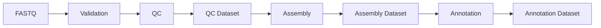

# Fluxo de dados

Todo dado entra por uma etapa de validação e passa a ser representado como um dataset identificável. Etapas posteriores consomem datasets validados e produzem novos datasets com linhagem explícita.

## Dataset reutilizável

Um dataset reutilizável é uma unidade de dados com identificador, origem, checksum, formato, versão, parâmetros de geração e relações de ancestralidade. Por exemplo, um **QC Dataset** pode ser consumido por diferentes estratégias de montagem sem repetir a validação ou perder o vínculo com os FASTQ originais.

O registro futuro deverá manter os dados brutos onde forem armazenados, sem duplicação desnecessária, e registrar metadados, referências e permissões adequadas. Dados humanos exigirão controles de acesso, minimização e bases legais compatíveis com a LGPD.
