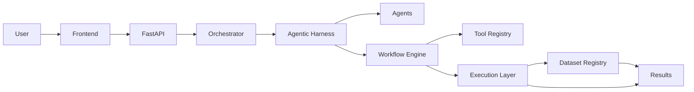

# Arquitetura do sistema

A plataforma separa interface, coordenação, decisão assistida, execução e dados. Essa separação permite desenvolver localmente com baixo consumo de recursos e delegar cargas científicas pesadas a ambientes adequados no futuro.

## Componentes

- **User / Frontend:** futura interação humana e visualização; não implementados na Fase 0.
- **FastAPI:** futura interface programática para pedidos, estados e resultados.
- **Orchestrator:** coordenará pedidos, políticas e ciclos de workflow.
- **Agentic Harness:** delimitará planejamento, seleção de ferramentas, validação e proveniência.
- **Agents:** papéis especializados futuros, sem autonomia fora das políticas do sistema.
- **Workflow Engine:** representará dependências, etapas e reexecuções.
- **Tool Registry:** catálogo versionado de ferramentas e seus contratos.
- **Execution Layer:** abstração para executar de forma mock, Colab, nuvem ou local.
- **Dataset Registry:** catálogo de entradas, derivados, metadados e linhagem.
- **Results:** saídas computacionais e metadados, separados de interpretação científica.
